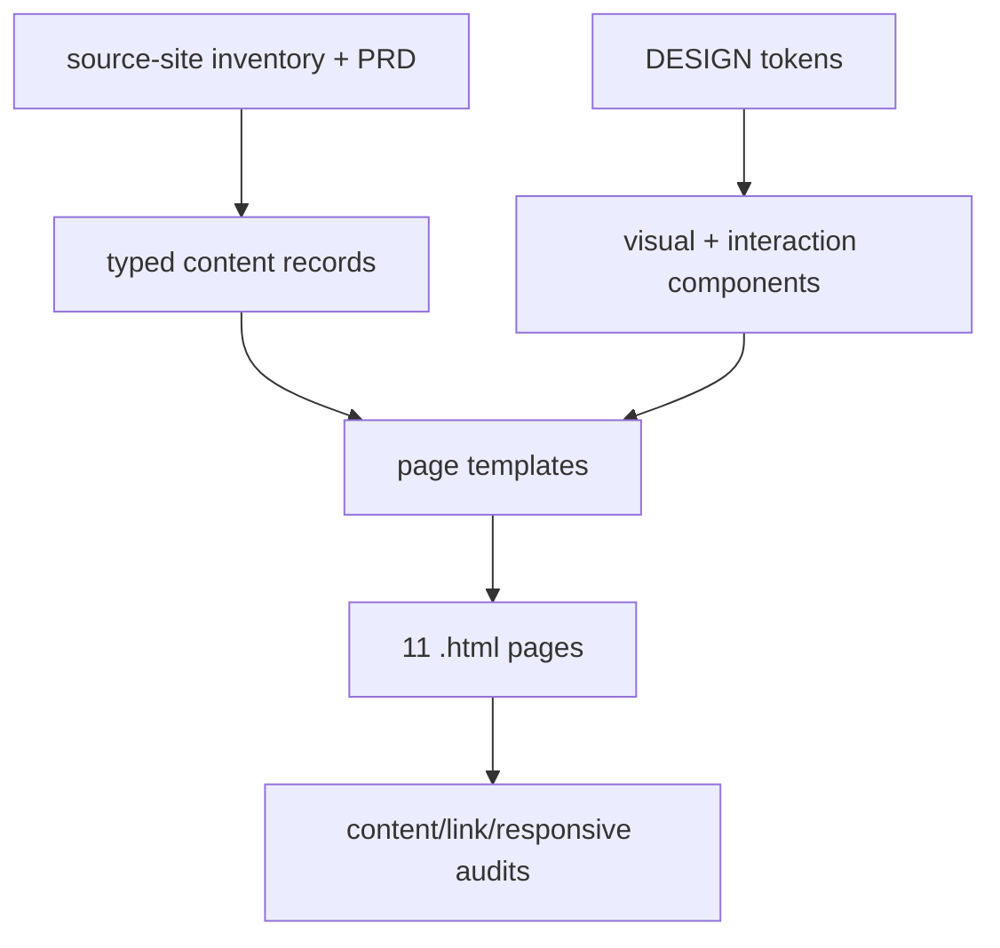
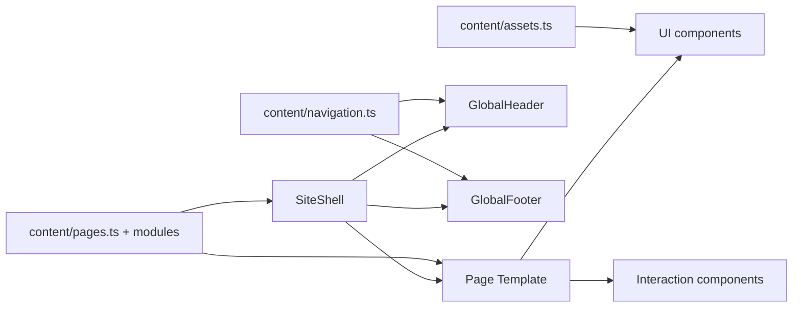

# Architecture Spine - company_workspace 官网 UI 重构

## Design Paradigm

本项目采用 **content-driven static site with shared page templates**：页面内容、SEO、链接、素材和模块顺序先被整理成 typed content records；页面模板只负责组合模块；视觉组件只消费 token 和内容数据；少量交互组件只拥有自己的本地状态。



## Invariants & Rules

### AD-1 - Source fidelity is the top boundary [ADOPTED]

- **Binds:** FR-1, FR-2, FR-3, FR-4, FR-5, FR-6, FR-16, FR-17, FR-18; all page templates
- **Prevents:** 设计或开发为了“更好看”新增业务内容、删除模块、改写 CTA、改 URL 或抹掉产品差异。
- **Rule:** 任何页面、组件、素材和文案输出必须能回溯到 `page-inventory.md`、PRD、DESIGN.md 或 EXPERIENCE.md；无法回溯的内容只能进入待确认清单，不能直接进入页面。

### AD-2 - Use static generation, not a backend/CMS

- **Binds:** MVP scope, non-goals, FR-12, FR-13, FR-14, FR-18
- **Prevents:** 为 11 个展示页引入后台、数据库、权限、运行时接口或内容运营系统，扩大实现和验收范围。
- **Rule:** 首版实现按静态站点构建；内容记录随代码版本管理。表单和联系路径保持源站链接，不新增站内提交逻辑。

### AD-3 - Preserve legacy `.html` routes

- **Binds:** FR-4, FR-5, FR-18, SM-3, SM-6
- **Prevents:** 构建产物变成 `/page/` 或新路由，导致旧链接、SEO、导航和外部入口失效。
- **Rule:** 构建配置必须输出或服务以下路径：`/index.html`、`/wisdom.html`、`/ai.html`、`/swiftcode.html`、`/lens.html`、`/sca.html`、`/swiftpenstest.html`、`/solution-auto.html`、`/solution-special.html`、`/service-penstest.html`、`/about.html`。未纳入重构的旧链接保留目标，不在本项目中改写。

### AD-4 - Page templates own composition; components never own page content

- **Binds:** FR-7, FR-8, FR-9, FR-10, FR-11, FR-12
- **Prevents:** 每个页面复制一套 HTML/CSS，或把产品文案硬编码进视觉组件，后续很难统一修改。
- **Rule:** 只能由 `HomeTemplate`、`ProductTemplate`、`SolutionTemplate`、`ServiceTemplate`、`AboutTemplate` 编排页面模块；`Button`、`Card`、`CapabilityBlock`、`SolutionTabs` 等组件不得包含某个页面专属文案。

### AD-5 - Tokens are the single visual source

- **Binds:** DESIGN.md, FR-12, FR-13, FR-14
- **Prevents:** 每页单独发明颜色、按钮、圆角、卡片和间距，导致视觉系统漂移。
- **Rule:** 全局 CSS variables 从 DESIGN.md 的 colors、typography、rounded、spacing、components 派生；页面级 CSS 只能做布局组合，不允许覆写主色、按钮形态、字体栈或卡片圆角。

### AD-6 - Navigation and footer are global contracts

- **Binds:** FR-4, FR-5, FR-6, UJ-1..UJ-4
- **Prevents:** 产品页、方案页或移动端遗漏导航、页脚、备案、外链、二级入口和联系路径。
- **Rule:** `GlobalHeader` 与 `GlobalFooter` 只从一份 navigation/footer data 读取；桌面和移动端共享同一份链接数据，不允许在移动端维护第二份手写菜单。

### AD-7 - Interaction state is local to interaction components

- **Binds:** FR-9, FR-11, FR-15, Accessibility Floor
- **Prevents:** tab、FAQ、菜单状态散落在页面脚本里，造成桌面和移动端行为不一致。
- **Rule:** `GlobalHeader` 管理菜单展开；`TabsOrAccordion` 管理 active panel；`FAQList` 管理展开项；页面模板只传入 data 和初始状态，不直接操作 DOM。

### AD-8 - Responsive behavior is defined at template/component level

- **Binds:** FR-13, FR-14, Responsive & Platform
- **Prevents:** 后期用零散 media query 修补每个页面，移动端仍出现横向滚动、遮挡、文字溢出。
- **Rule:** 断点、栅格、按钮堆叠、tab-to-accordion、长标题换行和图片容器比例必须写进模板或组件规则；页面内容记录不得携带布局 hack。

### AD-9 - SEO and metadata come from page records

- **Binds:** FR-16, FR-18, SM-6
- **Prevents:** title/description/keywords 在模板、页面和组件里多处重复，重构时遗漏或错配。
- **Rule:** 每个页面记录必须包含 `route`、`title`、`description`、`keywords`、`canonicalLegacyUrl`；渲染层从该记录生成 head 信息和页面级验收数据。

### AD-10 - Assets are governed by an asset registry

- **Binds:** FR-17, DESIGN.md imagery rules, EXPERIENCE.md image-missing state
- **Prevents:** 图片被随意替换、缺少 alt、使用带文字/Logo 的生成图或无法说明来源的抽象素材。
- **Rule:** 页面只引用 asset registry 中登记的素材；每个素材至少记录 `id`、`sourcePath`、`role`、`alt`、`sourcePage`、`replacementStatus`。替换素材必须标记为 `needs-approval` 直到人工确认。

### AD-11 - Verification is part of the architecture, not a final afterthought

- **Binds:** 9.1/9.2 acceptance criteria, SM-1..SM-6, Validation Checklist
- **Prevents:** 页面看起来完成但缺模块、错链接、移动端溢出、SEO 丢失或 CTA 路径错误。
- **Rule:** 每个页面 Story 的 Definition of Done 必须包含：route 200、模块清单对照、CTA/link audit、SEO audit、desktop screenshot、mobile screenshot、横向滚动检查、交互状态检查。

### AD-12 - Deployment is static, but certificate/hosting remain separate risks

- **Binds:** FR-19, risks, deferred operations
- **Prevents:** 把源站 HTTPS 证书修复和 UI 重构混在同一个开发范围里，或上线前忘记证书问题。
- **Rule:** 架构只要求可生成静态产物；证书、域名、服务器/CDN 作为独立运维项跟踪，上线前必须验证但不由页面组件承担。

## Consistency Conventions

| Concern | Convention |
| --- | --- |
| File naming | Routes and content ids use source filename stems: `wisdom`, `ai`, `swiftcode`, `lens`, `sca`, `swiftpenstest`, `solution-auto`, `solution-special`, `service-penstest`, `about`. Components use PascalCase. |
| Content ids | Stable kebab-case ids: `product-swift-sca`, `solution-auto`, `service-penstest`. Do not use visible Chinese titles as ids. |
| Data shape | Page record = metadata + template type + ordered modules + CTA list + assets + legacy source URL. |
| Dates | ISO `YYYY-MM-DD` only. |
| Links | Internal links keep source `.html` targets. External links are explicit and auditable. |
| CSS | Global tokens in `src/styles/tokens.css`; component-scoped CSS for implementation; no page-level color/token overrides. |
| State | Interactive state remains in the component that renders the control. No global store for this static site. |
| Accessibility | Every interactive component exposes keyboard and focus states; image alt is owned by asset registry/content record. |
| Errors/missing content | Missing image keeps layout space and shows neutral fallback; missing required copy fails build/audit instead of silently rendering empty modules. |

## Stack

| Name | Version |
| --- | --- |
| Astro | 7.x |
| Vite | 8.x through Astro 7 |
| TypeScript | Project-pinned version during implementation |
| CSS | Native CSS custom properties + component-scoped CSS |
| Runtime model | Static site generation, no CMS/backend for MVP |

## Structural Seed

```text
website/
  astro.config.mjs              # static build, .html route output, shared build options
  package.json                  # scripts and pinned toolchain
  src/
    pages/
      index.astro
      wisdom.astro
      ai.astro
      swiftcode.astro
      lens.astro
      sca.astro
      swiftpenstest.astro
      solution-auto.astro
      solution-special.astro
      service-penstest.astro
      about.astro
    layouts/
      SiteShell.astro           # head metadata, global header/footer, base slots
    templates/
      HomeTemplate.astro
      ProductTemplate.astro
      SolutionTemplate.astro
      ServiceTemplate.astro
      AboutTemplate.astro
    components/
      global/
        GlobalHeader.astro
        GlobalFooter.astro
        BottomCTA.astro
      ui/
        Button.astro
        SectionBand.astro
        CapabilityBlock.astro
        MetricBlock.astro
        MediaFrame.astro
        CardList.astro
      interaction/
        TabsOrAccordion.astro
        FAQList.astro
        MobileMenu.astro
    content/
      pages.ts                  # 11 page records and metadata
      navigation.ts             # shared nav/footer links
      assets.ts                 # source-site asset registry
      modules/                  # typed module records by page family
    styles/
      tokens.css
      base.css
      utilities.css
    audits/
      page-contracts.ts         # module/link/SEO/source-fidelity checks
  public/
    assets/
      source-site/              # migrated source images, logos, screenshots
```



### Component Split

| Layer | Components / Files | Owns | Must not own |
| --- | --- | --- | --- |
| Shell | `SiteShell`, `GlobalHeader`, `GlobalFooter`, `BottomCTA` | Page chrome, metadata slot, shared navigation/footer/CTA placement | Page-specific product copy |
| Templates | `HomeTemplate`, `ProductTemplate`, `SolutionTemplate`, `ServiceTemplate`, `AboutTemplate` | Module order, layout rhythm, page-family responsive rules | Token values, link targets, raw source data |
| UI components | `Button`, `SectionBand`, `CapabilityBlock`, `MetricBlock`, `MediaFrame`, `CardList` | Visual rendering from tokens and props | Business decisions, hidden copy changes, route decisions |
| Interaction components | `MobileMenu`, `TabsOrAccordion`, `FAQList` | Local state, keyboard behavior, active/expanded/focus styling | Page-level content ownership |
| Content records | `pages.ts`, `modules/*`, `navigation.ts`, `assets.ts` | Source text, SEO, CTA targets, asset metadata, module inventory mapping | Styling exceptions |
| Audits | `page-contracts.ts`, screenshot/link checks | Automated source-fidelity and responsive gates | Manual visual taste decisions |

## Capability -> Architecture Map

| Capability / Area | Lives in | Governed by |
| --- | --- | --- |
| FR-1 Page list | `src/pages/*`, `content/pages.ts` | AD-1, AD-3, AD-11 |
| FR-2/FR-3 Content and module preservation | `content/modules/*`, templates | AD-1, AD-4, AD-11 |
| FR-4/FR-6 Navigation/footer | `content/navigation.ts`, `GlobalHeader`, `GlobalFooter` | AD-6, AD-11 |
| FR-5 CTA paths | page records, `Button`, `BottomCTA` | AD-1, AD-3, AD-6 |
| FR-7 Homepage rebuild | `HomeTemplate` | AD-4, AD-5, AD-8 |
| FR-8 Product pages | `ProductTemplate`, product module records | AD-1, AD-4, AD-8 |
| FR-9 Solution pages | `SolutionTemplate`, `TabsOrAccordion` | AD-4, AD-7, AD-8 |
| FR-10 Service page | `ServiceTemplate` | AD-4, AD-5, AD-8 |
| FR-11 About page | `AboutTemplate`, `FAQList` | AD-4, AD-7, AD-8 |
| FR-12 UI component rules | `styles/tokens.css`, `components/ui/*` | AD-5, conventions |
| FR-13/FR-14 Responsive | templates, components, audits | AD-8, AD-11 |
| FR-15 Interaction states | `components/interaction/*` | AD-7, AD-11 |
| FR-16 SEO | page metadata records, `SiteShell` | AD-9, AD-11 |
| FR-17 Assets | `content/assets.ts`, `public/assets/source-site/*` | AD-10, AD-11 |
| FR-18 URL structure | `astro.config.mjs`, pages, audits | AD-3, AD-11 |
| FR-19 HTTPS risk | deployment checklist / ops issue | AD-12 |

## Deferred

| Decision | Why it can wait | Revisit when |
| --- | --- | --- |
| Exact hosting/CDN target | PRD excludes deployment and operations from UI rebuild scope. | Before production deployment or when existing hosting constraints are known. |
| Exact package manager and Node version | Current repo/hosting target is not provided. | When creating the frontend project scaffold. |
| Whether `contact.html` enters rebuild scope | PRD treats it as preserved link, not in 11-page scope. | User decides contact page should be rebuilt. |
| Screenshot baseline source | PRD requires screenshots but they have not been captured yet. | Before story implementation starts. |
| Exact TypeScript version | Should be pinned by generated project starter/package lock, not guessed in architecture. | During scaffold creation. |
| Visual asset replacement approvals | Source asset list exists conceptually but actual replacements need human review. | When building asset registry and page mockups. |
| Test runner choice | The invariant is audit coverage, not the tool. | When implementation repo exists; default to lightweight scripts or Playwright if browser checks are needed. |
