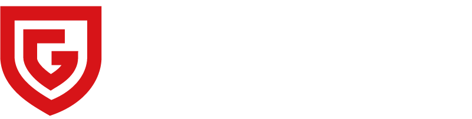

# 品牌资产规范

## 强制规则

- MUST 使用本文列出的正式资产文件，不得重新绘制或由 AI 生成近似 Logo。
- MUST 保持 Logo 原始宽高比，不得拉伸、压缩、裁切或旋转。
- MUST 在浅色背景使用标准色版本，在深色背景使用反白版本。
- MUST NOT 擅自改色、加描边、阴影、渐变、发光或背景容器。
- MUST NOT 将公司名称重新排版后冒充正式组合标识。
- SHOULD 优先使用 SVG；PNG 仅作为反白位图或不支持 SVG 时的兼容版本。

## 已整理资产

| 变体 | 文件 | 技术信息 | 使用场景 |
|---|---|---|---|
| 中英文横版标准色 | `src/assets/brand/logos/zkgy-logo-horizontal-color.svg` | 矢量路径；`viewBox="0 0 266.5 66.87"`；无字体和外链图片依赖 | 浅色或白色背景；网站导航和常规品牌露出；网页首选版本 |
| 中英文横版反白 | `src/assets/brand/logos/zkgy-logo-horizontal-reverse.png` | `801 × 202`；RGBA；透明背景 | 深色背景；现阶段反白兼容版本 |

## 选择逻辑

1. 背景为白色或浅色：使用 `zkgy-logo-horizontal-color.svg`。
2. 背景为深色：使用 `zkgy-logo-horizontal-reverse.png`。
3. 需要大尺寸反白 Logo：不要放大 PNG，也不要自行把标准色 SVG 改成白色；应补充官方反白 SVG。
4. 没有明确背景对比度时：停止选择并先确认页面背景。

## 实现方式

在 React/Vite 项目中从资产目录导入，不要复制 SVG 源码到页面组件：

```tsx
import logoHorizontalColor from '@/assets/brand/logos/zkgy-logo-horizontal-color.svg';


```

深色表面使用反白版本：

```tsx
import logoHorizontalReverse from '@/assets/brand/logos/zkgy-logo-horizontal-reverse.png';


```

实际 CSS 尺寸可响应式缩放，但必须使用 `height: auto` 保持比例。

## 无障碍

- Logo 链接到首页时，使用 `alt="中科固源首页"`。
- Logo 纯装饰且附近已有等价品牌文字时，使用空替代文本 `alt=""`。
- 不要在相邻可见文字和 `alt` 中重复冗长的公司介绍。

## Lovable 执行要求

在创建或修改导航、页脚、登录页、品牌页以及其他含 Logo 的界面前：

1. 先读取本文件。
2. 根据背景选择已批准的变体。
3. 引用现有资产，不得生成、重绘或用文字替代 Logo。
4. 不得直接使用原始中文文件名或本地 Desktop 绝对路径。
5. 如果现有两种变体不适用，报告缺失的资产变体，不得自行制作。

## 预览

标准色版本：


反白版本具有透明背景，应在深色表面中检查：


